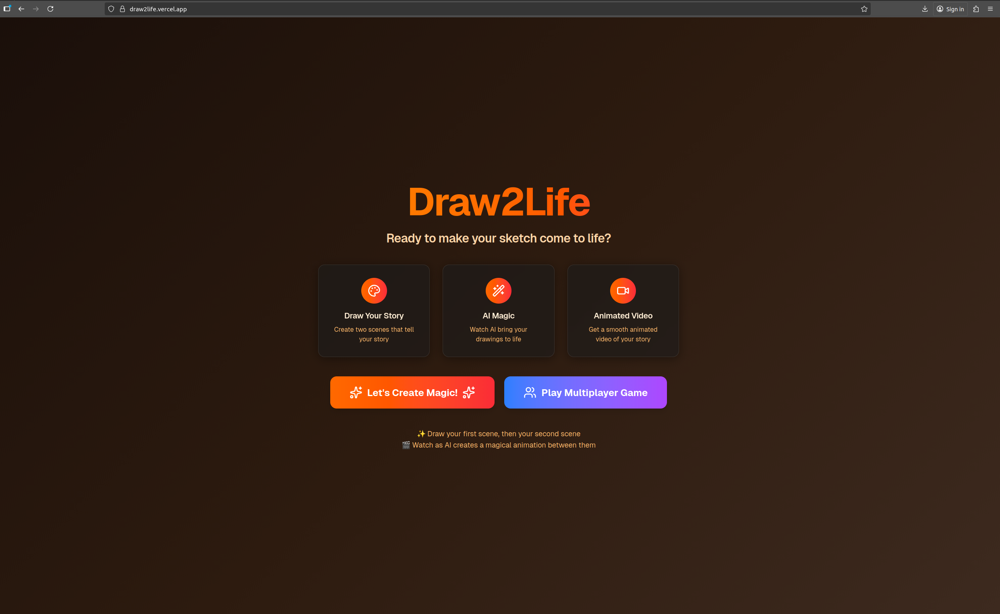
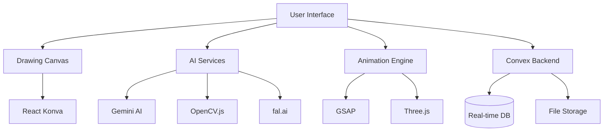

<div align="center">

# 🎨 Draw2Life

### Transform Children's Drawings into Living, Animated Stories

**An AI-powered educational platform that brings imagination to life**

[](https://draw2life.vercel.app)
[](https://choosealicense.com/licenses/mit/)
[](https://nextjs.org/)
[](https://www.typescriptlang.org/)
[](https://ai.google.dev/)

[🚀 Live Demo](https://draw2life.vercel.app) • [📺 Watch Video](https://www.youtube.com/watch?v=e3406-d4YIQ) • [📖 Documentation](#-quick-start) • [🐛 Report Bug](https://github.com/anuragroy2001/draw2life/issues)

</div>

---

## 📸 Preview

<div align="center">

### ✨ [Try the Live Demo](https://draw2life.vercel.app) ✨

</div>

> **Add your app banner/hero image here**
> 
> *Screenshot showing the main interface with a child's drawing being animated*



---

## ✨ What is Draw2Life?

**Draw2Life** is a magical educational platform where children's creativity meets cutting-edge AI technology. Kids draw their imagination on a digital canvas, and our AI brings their creations to life with animations, 3D scenes, and educational narration.

Perfect for:
- 🎓 **Educators** - Engage students with interactive art and storytelling
- 👨‍👩‍👧 **Parents** - Encourage creativity and learning at home
- 🎨 **Children** - Express imagination and see drawings come alive
- 🏫 **Schools** - Modern, interactive art and science education tool

### 🌟 Why Draw2Life?

| Traditional Drawing Apps | 🚀 Draw2Life |
|-------------------------|-------------|
| Static drawings | **Living, animated scenes** |
| No feedback | **AI-powered educational insights** |
| 2D only | **2D + immersive 3D views** |
| Solo experience | **Multiplayer games & collaboration** |
| No export | **Create shareable MP4 videos** |

---

## 🎬 Demo Video

<div align="center">

### 📺 Watch Draw2Life in Action

[](https://www.youtube.com/watch?v=e3406-d4YIQ)

**[▶️ Watch on YouTube](https://www.youtube.com/watch?v=e3406-d4YIQ)**

*See the complete workflow: Draw → AI Analysis → Animation → 3D View → Video Export*

</div>

---

## 🚀 Key Features

### 🎨 Professional Drawing Canvas
Create stunning artwork with a full-featured drawing interface powered by React Konva.


*Intuitive tools for creative expression*

**Features:**
- ✏️ Multiple drawing tools: pen, eraser, shapes, text, selection, move
- 🎨 Rich color palette with 20+ colors + custom color picker
- 📏 Adjustable stroke width and opacity controls
- 📚 Advanced layer management system
- ↩️ Unlimited undo/redo functionality
- 💾 Import/Export your masterpieces

---

### 🤖 AI-Powered Understanding
Our Gemini AI analyzes drawings and generates educational insights that help children learn while they create.


*Intelligent scene detection and educational narration*

**Capabilities:**
- 🔍 Structured scene analysis with smart object detection
- 📖 Age-appropriate educational narration generation
- 🖼️ Advanced image preprocessing with OpenCV.js
- 🧠 Context-aware understanding of children's drawings

---

### ✨ Dynamic Animations
Watch drawings come to life with professional-grade animations in both 2D and 3D.

<div align="center">

| 2D Animations | 3D Playground |
|:------------:|:-------------:|
|  |  |
| *GSAP-powered smooth animations* | *Interactive Three.js 3D scenes* |

</div>

**Animation Features:**
- 🎭 GSAP-powered 2D animations: bounce, float, rotate, scale, move, fade
- 🌍 Immersive Three.js 3D playground with interactive objects
- 🎮 Full playback controls: play, pause, stop, speed adjustment
- ⏱️ Timeline-based animation sequences
- 🔊 Audio controls for educational narration

---

### 🎥 Video Export
Transform drawings into shareable MP4 videos powered by fal.ai's cutting-edge AI technology.


*Export and share animated creations*

**Export Features:**
- 📹 AI-generated animated MP4 videos
- ⏳ Real-time progress tracking
- 👀 Video preview before download
- 🎙️ Integrated educational narration
- 📤 Easy sharing on social media

---

### 🎮 Multiplayer Drawing Game
Collaborative drawing challenges where players compete and vote on creative interpretations.


*Fun, social creative challenges*

**Game Features:**
- 👥 Real-time multiplayer sessions
- 🎯 Creative prompt-based challenges
- 🗳️ Peer voting system
- 🏆 Round-based scoring
- 🎊 Live results and winner announcements

---

## 🛠️ Tech Stack

<div align="center">

### Frontend
[](https://nextjs.org/)
[](https://www.typescriptlang.org/)
[](https://react.dev/)
[](https://tailwindcss.com/)

### Canvas & Animation
[](https://konvajs.org/docs/react/)
[](https://greensock.com/gsap/)
[](https://threejs.org/)
[](https://www.framer.com/motion/)

### AI & Backend
[](https://ai.google.dev/)
[](https://fal.ai/)
[](https://www.convex.dev/)
[](https://docs.opencv.org/4.x/d5/d10/tutorial_js_root.html)

</div>

---

## 📱 Screenshots

<details>
<summary><strong>Click to see more screenshots</strong></summary>

### Landing Page

*Welcoming home screen with clear call-to-action*

### Layer Management

*Professional layer organization system*

### Color Picker

*Extensive color options with custom picker*

### Animation Controls

*Intuitive playback and speed controls*

### Game Lobby

*Multiplayer waiting room*

### Voting Screen

*Vote on favorite drawings*

</details>

---

## 🚦 Quick Start

### 🌐 Try It Now!

**Don't want to install anything?** Try the live demo right away:

👉 **[draw2life.vercel.app](https://draw2life.vercel.app)** 👈

Just visit the link and start drawing! No setup required.

---

### 💻 Local Development Setup

Want to run it locally or contribute? Get Draw2Life up and running in under 5 minutes!

#### Prerequisites

- **Node.js** 18.0 or higher
- **npm** or **yarn** package manager
- A **Google account** (for Gemini API)
- A **fal.ai account** (for video generation)

#### Installation Steps

**1️⃣ Clone the repository**

```bash
git clone https://github.com/anuragroy2001/draw2life.git
cd draw2life
```

**2️⃣ Install dependencies**

```bash
npm install
# or
yarn install
```

**3️⃣ Set up environment variables**

Choose one of these options:

<details>
<summary><strong>Option A: Quick Setup Script (Recommended)</strong></summary>

Run our interactive setup script that will guide you through the process:

```bash
npm run setup
```

The script will:
- ✅ Prompt you for your API keys
- ✅ Create `.env.local` automatically
- ✅ Validate your configuration
- ✅ Get you ready to launch

</details>

<details>
<summary><strong>Option B: Manual Setup</strong></summary>

1. Copy the example environment file:
   ```bash
   cp .env.example .env.local
   ```

2. Edit `.env.local` and add your API keys:
   ```env
   # Required: Gemini API Key for AI features
   NEXT_PUBLIC_GEMINI_API_KEY=your_gemini_api_key_here
   
   # Required: fal.ai API Key for video generation
   FAL_KEY_ID=your_fal_api_key_here
   ```

</details>

**4️⃣ Get your API keys**

<details>
<summary><strong>📝 Gemini API Key (Required for AI features)</strong></summary>

1. Visit [Google AI Studio](https://makersuite.google.com/app/apikey)
2. Sign in with your Google account
3. Click **"Create API Key"**
4. Copy the generated key
5. Add it to `.env.local` as `NEXT_PUBLIC_GEMINI_API_KEY`

> 💡 **Tip:** Gemini API has a generous free tier perfect for testing!

</details>

<details>
<summary><strong>🎥 fal.ai API Key (Required for video generation)</strong></summary>

1. Go to [fal.ai dashboard](https://fal.ai/dashboard/keys)
2. Sign up for a free account
3. Navigate to **API Keys** section
4. Create a new key
5. Copy it and add to `.env.local` as `FAL_KEY_ID`

> 💡 **Tip:** fal.ai offers free credits to get started!

</details>

**5️⃣ Launch the app**

```bash
npm run dev
```

🎉 **Success!** Open [http://localhost:3000](http://localhost:3000) and start creating!

---

## 🎯 Usage Guide

### For First-Time Users

**Step 1: Draw Your Masterpiece** 🎨
- Select a tool from the toolbar (pen, shapes, eraser)
- Pick colors from the vibrant palette
- Use layers to organize complex drawings
- Don't worry about perfection - the AI understands kids' drawings!


**Step 2: Let AI Analyze** 🤖
- Click **"Understand My Drawing"** button
- Wait 5-10 seconds for AI magic
- Read the educational narration
- Discover what the AI learned from your art!


**Step 3: Animate Your Creation** ✨
- Hit the **Play** button to see animations
- Adjust speed and view the timeline
- Try different animation styles
- Objects will bounce, float, and come alive!


**Step 4: Explore in 3D** 🌍
- Click **"3D View"** for immersive experience
- Drag to rotate the 3D scene
- Watch objects float in 3D space
- Zoom in and out to explore details


**Step 5: Export & Share** 📤
- Click **"Export Video"**
- Wait 20-30 seconds for AI video generation
- Preview your animated video
- Download and share with friends!


### Playing the Multiplayer Game 🎮

1. Navigate to `/game` route
2. Enter a game session
3. Draw based on the creative prompt
4. Vote on your favorite submissions
5. See who wins each round!

## 🏗️ Architecture & Project Structure

### High-Level Architecture



### Directory Structure

```
draw2life/
├── src/
│   ├── app/                      # Next.js App Router
│   │   ├── page.tsx              # Landing page
│   │   ├── game/                 # Multiplayer game routes
│   │   └── layout.tsx            # Root layout
│   ├── components/
│   │   ├── canvas/               # Drawing interface
│   │   │   ├── Workspace.tsx    # Main container
│   │   │   ├── DrawingCanvas.tsx # Konva canvas
│   │   │   ├── Toolbar.tsx      # Tool controls
│   │   │   └── LayerPanel.tsx   # Layer management
│   │   ├── ai/                   # AI integration
│   │   │   ├── SceneAnalyzer.tsx
│   │   │   ├── SceneEnhancer.tsx
│   │   │   └── AIImageGenerator.tsx
│   │   ├── animation/            # Animation system
│   │   │   ├── AnimationControls.tsx
│   │   │   └── ThreeDPlayground.tsx
│   │   ├── game/                 # Multiplayer components
│   │   │   ├── GameOrchestrator.tsx
│   │   │   ├── VotingScreen.tsx
│   │   │   └── GameResults.tsx
│   │   └── video/
│   │       └── VideoExporter.tsx
│   ├── lib/                      # Core services
│   │   ├── ai-service.ts        # Gemini integration
│   │   ├── animation-engine.ts   # GSAP animations
│   │   ├── image-processor.ts    # OpenCV processing
│   │   └── video-export-service.ts
│   └── types/                    # TypeScript definitions
├── convex/                       # Backend functions
│   ├── projects.ts              # Project CRUD
│   ├── scenes.ts                # Scene management
│   ├── gameSessions.ts          # Multiplayer logic
│   └── schema.ts                # Database schema
└── public/                       # Static assets
```

### Key Components

| Component | Purpose | Tech Stack |
|-----------|---------|------------|
| **Workspace** | Main application container | Next.js, React |
| **DrawingCanvas** | Interactive drawing surface | React Konva |
| **SceneAnalyzer** | AI-powered scene understanding | Gemini API, OpenCV.js |
| **AnimationControls** | Animation playback interface | GSAP, React |
| **ThreeDPlayground** | 3D scene viewer | Three.js, React Three Fiber |
| **VideoExporter** | Video generation & download | fal.ai API |
| **GameOrchestrator** | Multiplayer game manager | Convex, React |

---

## 🗺️ Roadmap

### ✅ Phase 1: Core Drawing (Completed)
- [x] Full-featured drawing canvas
- [x] Multi-layer support
- [x] Comprehensive toolset
- [x] Import/Export functionality

### ✅ Phase 2: AI Integration (Completed)
- [x] Gemini API integration
- [x] Scene analysis & object detection
- [x] Educational narration generation
- [x] 2D & 3D animation engine

### ✅ Phase 3: Video Export (Completed)
- [x] AI-powered video generation
- [x] Real-time progress tracking
- [x] Video preview & download

### 🚧 Phase 4: Collaboration (In Progress)
- [x] Multiplayer drawing game
- [ ] Real-time collaborative canvas
- [ ] Shared project workspaces
- [ ] Live cursor tracking

### 📅 Phase 5: Voice & Audio (Coming Soon)
- [ ] Gemini Live API integration
- [ ] Voice tutoring and feedback
- [ ] Audio narration for animations
- [ ] Speech-to-text for prompts

### 🔮 Phase 6: Mobile & PWA (Future)
- [ ] Progressive Web App (PWA)
- [ ] Offline support
- [ ] Mobile-optimized UI
- [ ] Touch gesture support
- [ ] App store deployment

### 🛡️ Phase 7: Safety & Compliance (Future)
- [ ] COPPA compliance
- [ ] Content moderation
- [ ] Parental controls
- [ ] Accessibility features (WCAG 2.1)
- [ ] Data privacy enhancements

---

## 🤝 Contributing

We love contributions! Here's how you can help make Draw2Life even better:

### Ways to Contribute

- 🐛 **Report Bugs** - Found a bug? [Open an issue](https://github.com/anuragroy2001/draw2life/issues)
- 💡 **Suggest Features** - Have ideas? [Share them with us](https://github.com/anuragroy2001/draw2life/issues)
- 📝 **Improve Docs** - Help make our documentation clearer
- 🎨 **Submit PRs** - Code contributions are always welcome
- ⭐ **Star the Repo** - Show your support!

### Development Workflow

1. **Fork** the repository
2. **Clone** your fork:
   ```bash
   git clone https://github.com/YOUR_USERNAME/draw2life.git
   ```
3. **Create** a feature branch:
   ```bash
   git checkout -b feature/amazing-feature
   ```
4. **Make** your changes and commit:
   ```bash
   git commit -m "Add amazing feature"
   ```
5. **Push** to your fork:
   ```bash
   git push origin feature/amazing-feature
   ```
6. **Open** a Pull Request

### Contribution Guidelines

- ✅ Write clean, readable TypeScript code
- ✅ Follow existing code style and conventions
- ✅ Add comments for complex logic
- ✅ Test your changes thoroughly
- ✅ Update documentation as needed
- ✅ Keep PRs focused on a single feature/fix
- ✅ Be respectful and constructive

### Code Style

We use ESLint and Prettier for code formatting:

```bash
npm run lint        # Check for linting errors
npm run format      # Auto-format code
```

---

## 📄 License

This project is licensed under the **MIT License** - see the [LICENSE](LICENSE) file for details.

### What this means:
- ✅ Use commercially
- ✅ Modify and distribute
- ✅ Private use
- ✅ Must include license and copyright notice

---

## 🙏 Acknowledgments

Special thanks to:

- **Google Gemini** for powerful AI capabilities
- **fal.ai** for amazing video generation
- **Convex** for seamless real-time backend
- **Vercel** for hosting and deployment
- **The open-source community** for incredible tools and libraries

---

## 📞 Support & Contact

Need help or have questions?

- 📧 **Email**: [your-email@example.com](mailto:your-email@example.com)
- 💬 **Issues**: [GitHub Issues](https://github.com/anuragroy2001/draw2life/issues)
- 🐦 **Twitter**: [@your_handle](https://twitter.com/your_handle)
- 💼 **LinkedIn**: [Your Name](https://linkedin.com/in/yourprofile)

---

## 🌟 Star History

[](https://star-history.com/#anuragroy2001/draw2life&Date)

---

<div align="center">

## 💝 Show Your Support

If you find Draw2Life helpful, please consider:

⭐ **Starring** the repository
🐦 **Sharing** on social media
☕ **Supporting** development

**Built with ❤️ for kids and education**

[⬆ Back to Top](#-draw2life)

</div>